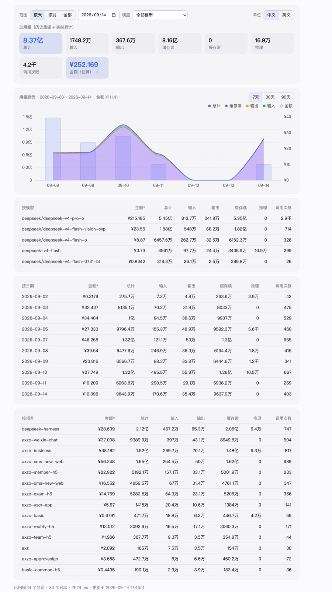

# dsh-token-use

[English](README.en.md) | 中文

[](https://awesome-dsh-plugin.com)

DeepSeek Harness 实时 Token 用量插件：安装后在 **设置 → Token 用量** 查看用量（自带设置侧边栏一级入口），页面每 5 秒刷新（页面隐藏时暂停，零轮询浪费）。

## 功能

- **总量卡片**：总计（输入+输出+缓存）、输入、输出、缓存读、缓存写、推理、调用次数。
- **范围筛选**：按天 / 按月 / 全部三个 tab，默认「按天=今天」；可选日期、月份。
- **模型筛选**：时间筛选旁的下拉框按模型过滤（含该模型的项目/按天维度明细），默认全部模型。
- **用量趋势折线图**：基于 ECharts（按需打包、随插件离线分发，不依赖 CDN）展示最近 30 天总计、输入、输出、缓存命中、调用次数五条折线；token 维度共用左轴，调用次数用右轴，悬停轴提示显示当日全部明细。图表用命令式渲染，鼠标移动不触发 React 重渲染。
- **单位切换**：中文（亿 / 万 / 千）与英文（B / M / K）一键切换，记忆选择。
- **明细表**：按模型、按日期、按项目三张表，含总计列。

## 为什么值得装

你在烧 token，但你说不清烧在哪：哪个项目最贵、哪个模型最吃缓存、这周比上周涨了多少。

**dsh-token-use 把这些变成一眼看得懂的数字。** 它跟着每一次调用实时累加，把总量、输入、输出、缓存命中、推理和调用次数摊开在设置页里，按模型、按天、按月、按项目随手切换，趋势用一条平滑曲线讲清楚。装完即用：不用配置、不用重启会话、不会在你写代码的时候跳出来打扰你。

看不见的成本最贵——把它变成看得见的。



## 安装

```sh
dsh plugin --profile web add github:huangyuheng/dsh-token-use
```

重启 `dsh web` 后生效。下载 zip 解压后的本地目录安装：

```sh
dsh plugin --profile web add /解压路径/dsh-token-use
```

## 性能设计

- 宿主侧 **不轮询、不写盘、不加定时器**：通过 `session/event` 事件总线做 O(1) 增量累加（每条 `assistant/message` 一次字典加法）。
- 启动时做 **一次性**历史重建：流式解压 `$DSH_HOME/sessions/**/session.jsonl.zstd`（`node:zlib` 原生 zstd），每读一个文件主动让出事件循环（`scheduler.yield()`），不阻塞会话处理；重建与实时事件用「会话 seq 水位」去重，任意先后顺序都不会重复计数。
- 只暴露一个只读 JSON 接口 `GET /dsh-token-use`（仅回环可访问，内存快照，`no-store`）。

```sh
# 全部
curl http://127.0.0.1:3080/dsh-token-use
# 指定日期 / 月份
curl 'http://127.0.0.1:3080/dsh-token-use?month=2026-09'
curl 'http://127.0.0.1:3080/dsh-token-use?day=2026-09-10'
# 指定模型（可与 day/month 组合）
curl 'http://127.0.0.1:3080/dsh-token-use?model=deepseek-v4-flash'
```

## 开发

```sh
pnpm install          # 仅开发需要（esbuild + echarts）
pnpm run build        # 重新生成 client/client.js（= 精简 ECharts + client/src.js）
```

`client/client.js` 是已提交的构建产物，使用者无需安装依赖或构建。

npm 发布元数据（`repository` / `files` / `LICENSE`）已备好但**暂不发布**：当前只通过 GitHub 安装（`dsh plugin --profile web add github:huangyuheng/dsh-token-use`）。需要时执行 `npm publish` 即可。

## 字段口径

- `input` / `output`：API 上报的输入/输出 tokens。
- `cacheRead` / `cacheWrite`：提示词缓存读/写 tokens（API 计费口径中缓存读也计入输入侧）。
- `reasoning`：推理 tokens。
- 模型归属：该会话最近一次 `request/header` 的 model；标题生成等无 usage 记录的小调用不在统计内。
- 项目归属：取会话创建头里的 `cwd`（实时事件读 `session.header.cwd`，历史扫描读日志头）；子会话/分叉会话继承父会话的项目；极少数暂时无法归属的调用先挂起，归属明确后自动回填，30 秒仍未明确才记入 `(no cwd)`。

## 兼容性

给他人安装前，这些差异都已处理：

| 维度 | 说明 |
| --- | --- |
| 运行环境 | 需要 **dsh web ≥ 0.1.0-rc.6**（设置侧边栏 `settings.section` 槽位）。宿主侧只用 Node 内置模块；zstd 解压依赖 `node:zlib`（Node ≥ 22.15 内置，dsh 自身要求 ^22.19 \|\| >=24，故必然满足）。 |
| 数据目录 | 按 `$DSH_HOME`（环境变量，缺省 `~/.dsh`）解析，与 dsh 官方 `dsh-home-paths` 规则一致；自定义 home 同样有效。插件**只读**，不写任何文件。 |
| 会话格式 | 同时支持 `session.jsonl[.zstd]`（多帧 zstd，含 checksum）、带版本号的新一代 `session.v<N>.jsonl[.zstd]`（dsh 迁移后会与旧文件并存），以及明文 `.jsonl`；同一会话**只读最高版本那一代**，不会重复计数；`.bak`/`.corrupt-*`/`session.lock` 自动跳过，个别损坏帧只计入 `scan.skipped`。 |
| 目录布局 | 兼容官方 JSONL 持久层的 `sessions/<项目目录>/<会话目录>/` 结构；会话按项目目录、会话 ID 独立读取。 |
| 统计口径 | 部分 provider（如 pi-ai 适配）会把推理 token 并入输出，此时「推理」列为 0 属正常；标题生成、联网搜索等不落 `usage` 的调用不计入；模型归属取该会话最近一次 `request/header`。 |
| 网络访问 | 接口默认**仅回环**。局域网部署（配置了 trustedHosts）时在 profile patch 里开 `allowRemote: true`，且仍只接受同源请求；客户端遇到 403 会直接提示原因。 |
| 性能 | 历史重建在 **Worker 线程**执行，不阻塞宿主事件循环；期间新事件先缓冲、扫描完成后回放，靠会话 seq 水位去重。之后只做事件增量。 |
| 多实例 | 每个 `$DSH_HOME` 独立统计；同一 home 下的多个 profile 共享 `sessions` 目录，统计会合并显示。 |

## 配置（cordis.patch.yml 可覆盖）

```yaml
- id: dsh-token-use
  name: 'dsh-token-use'
  config:
    endpoint: /dsh-token-use
    scanAtBoot: true    # false 则只统计插件启动之后的实时用量
    allowRemote: false  # 局域网（非回环）访问时设为 true，仅接受同源请求
```

## 安装后

1. 重启 `dsh web`（bundle 成员变化必须重启才生效）；
2. 打开 **设置 → Token 用量**；
3. 也可以用命令行：`curl 'http://127.0.0.1:3080/dsh-token-use?month=2026-09'`。
